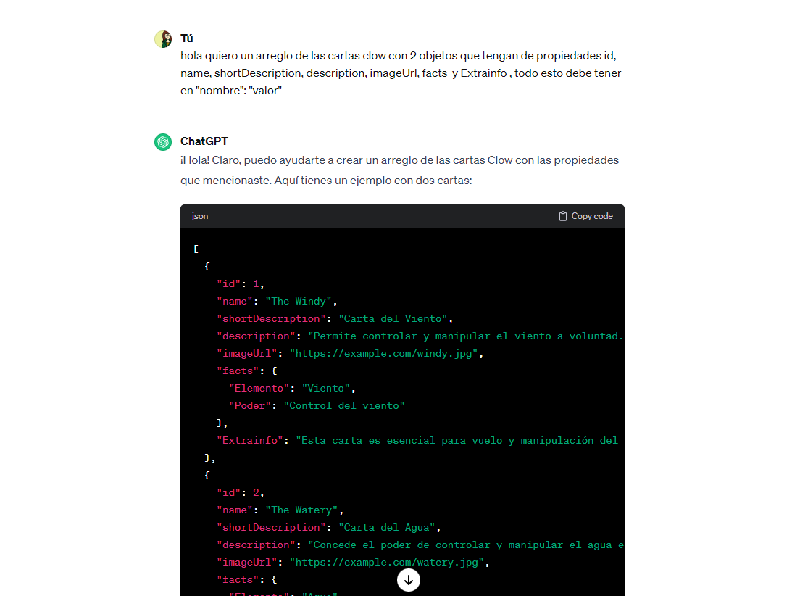
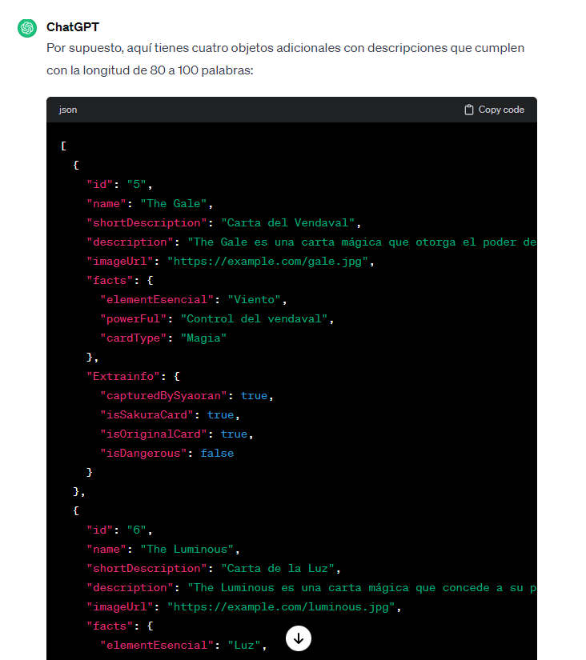

# Dataverse Sakura

## Índice

* [1. Resumen del proyecto](#1-resumen-del-proyecto).
* [2. Consideraciones generales](#2-consideraciones-generales)
* [3. Funcionalidades](#3-funcionalidades)
* [4. Consideraciones técnicas](#4-consideraciones-técnicas)
* [5. Criterios de aceptación mínimos del proyecto](#5-criterios-de-aceptación-mínimos-del-proyecto)
* [6. Hacker edition](#6-hacker-edition)
* [7. Objetivos de aprendizaje](#7-objetivos-de-aprendizaje)
* [8. Pistas, tips y lecturas complementarias](#8-pistas-tips-y-lecturas-complementarias)
* [9. Consideraciones para pedir tu Project Feedback](#9-consideraciones-para-pedir-tu-project-feedback)

***
## 1. Resumen del proyecto

En este proyecto se construyó una _página web_ para visualizar un
_conjunto (set) de datos_ que se generó con [prompting](https://www.itmadrid.com/que-es-un-prompt-en-inteligencia-artificial-ia/).
 
Además, en este proyecto se utilizó herramientas de
[inteligencia artificial](https://es.wikipedia.org/wiki/Inteligencia_artificial)
como [ChatGPT](https://openai.com/chatgpt), [ExplainDev](https://explain.dev/),
entre otras para generar un set de datos en un archivo javascript.

El propósito de generar los datos en esta manera es brindar la oportunidad de
adentrarte en el empleo de herramientas impulsadas por la inteligencia
artificial, así como en [técnicas de
prompting](https://learnprompting.org/es/docs/intro).

Como entregable final la página web permite **visualizar la data,
filtrarla, ordenarla y calcular alguna estadística**. Con estadística
nos referimos a distintos cálculos que puedes hacer con los datos para mostrar
información aún más relevante a las usuarias (promedio, el valor máximo
o mínimo, etc).

## 2. Consideraciones generales

* Este proyecto se realizo de forma colaborativa en dupla.
* El rango de tiempo estimado fue de 4 sprints.
* El proyecto se entrego subiendo el código a GitHub (commit/push) y la
  interfaz se desplego usando [GitHub Pages](https://pages.github.com/).
  

## 3. Funcionalidades

Aquí definimos en más detalle las funcionalidades que tiene:

***Filtrado*** :
Los usuarios tendrán la capacidad de explorar y filtrar las cartas disponibles en la plataforma de acuerdo con sus preferencias individuales. En particular, la opción de filtrar las cartas según su elemento, ya sea climático, relacionado con la naturaleza, de dualidad, mágico, emocional, versátil o vinculado al tiempo. Asimismo, la capacidad de filtrar las cartas según su nivel de peligrosidad, permitiéndoles distinguir entre cartas peligrosas e inofensivas.

La implementación de esta funcionalidad brindará a los usuarios la flexibilidad para personalizar su experiencia, centrándose en los elementos o características que más les interesen en un momento dado. Esto contribuirá a la eficiencia en la exploración y facilitará la búsqueda de cartas específicas dentro de la plataforma

***Ordenamiento*** :

Los usuarios tendrán de la capacidad de ordenar las cartas proporcionadas de manera ascendente (A-Z) o descendente (Z-A), según sus preferencias individuales. Esta funcionalidad les permitirá realizar búsquedas más efectivas y personalizadas, facilitando la localización de cartas específicas de acuerdo con sus necesidades y preferencias.

***Estadísticas*** :

Adicionalmente a las funcionalidades previamente mencionadas, los usuarios tendrán la capacidad de acceder a estadísticas específicas de las cartas. Estas estadísticas incluirán el porcentaje de cartas catalogadas como peligrosas y el porcentaje correspondiente a cartas inofensivas. Asimismo, se proporcionará información detallada sobre el porcentaje de cartas capturadas por 'Sakura' y el porcentaje correspondiente a las cartas capturadas por 'Syaoran'. Esta característica ofrecerá a los usuarios una visión más detallada y completa de las dinámicas y resultados relacionados con las cartas dentro de la plataforma.

## 4. Consideraciones técnicas

Este proyecto se ha llevado a cabo siguiendo las consideraciones técnicas establecidas en el marco del bootcamp de Laboratoria Dataverse. Se han respetado rigurosamente los principios fundamentales de dicho marco para garantizar su coherencia y alineación con los estándares recomendados.
Los que son visualizar la data, filtrarla, ordenarla y calcular alguna estadística

La lógica del proyecto esta implementada completamente en JavaScript
(ES6), HTML y CSS. En este proyecto NO ese usó librerías o
frameworks, solo [vanilla JavaScript](https://medium.com/laboratoria-how-to/vanillajs-vs-jquery-31e623bbd46e).

El _boilerplate_ contiene una estructura de archivos como punto de partida así
como toda la configuración de dependencias:

```text
.
├── README.md
├── package.json
├── src
|  ├── data 
|  |  └── dataset.js (La que hayas generado con la IA)
|  ├── dataFunctions.js
|  ├── view.js
|  ├── index.html
|  ├── main.js
|  └── style.css
└── test
   └── data.js
   └── dataFunctions.spec.js
   └── tests-read-only

```

### Criterios del proyecto

#### Definición del producto

Se realizó una serie de preguntas para poder definir nuestros usuarios, el producto en el cual queriamos trabajar y cuales eran nuestros objetivos. Las preguntas fueron las siguientes:

*¿Quiénes son las principales usuarias del producto?*
- Adolescentes y jóvenes, así como el público interesado en consumir contenido de anime.

*¿Cuáles son los objetivos de estas usuarias en relación con el producto?*
-  Adquirir un mayor conocimiento sobre el anime y conocer mas a fondo las cartas clow.

*¿Cuáles son los datos más relevantes que quieren ver en la interfaz y por qué?*
- Exhibir las cartas y los personajes. Estos elementos son destacados y llamativos en el anime, por lo que su visualización contribuirá significativamente a la experiencia del usuario.

*¿Cuándo utilizan o utilizarían el producto?*
- Utilizarían el producto cuando deseen obtener información sobre las cartas, incluyendo su cantidad, tipos y características específicas.

#### Historias de usuario
Además, se han creado historias de usuario para abordar cada funcionalidad, facilitando la planificación de los sprints al desglosar cada historia en tareas específicas.

####***Historia de usuario 1*** :
Yo como fan del anime Sakura Card Captor quiero que ver imagenes de las cartas clow.
- Tareas:

    - Entender la generación de datos (data.js e importar la data).
    - El html se debe generar de forma dinamica en el View.js .
    - Hacer el html y css responsive

- Criterio de aceptación:

    - Se debe ver en formato cards
    - Debe verse responsive (celular y pc)
    - Se debe visualizar el nombre e imagen de la carta clow.
    - No hay ningún tipo de interacción

- Definición de terminado:

    - Todo el código esta subido a la rama principal del repositorio
    - Corren bien los test del prompting
    - Es Responsive

####***Historia de usuario 2*** :

####***Historia de usuario 3*** :


#### Generar los datos

Se generaron los datos con la temática de Cartas Clow del anime de Sakura Card Captor. Se utilizó el chatgpt para generarlos en el cual obtuvimos 1 array con 24 objetos con las siguientes propiedades a considerar:

* `id`: Identificador único (no pueden haber dos elementos con el mismo `id`).
  Debe ser un string de no más de 32 characteres, en minúscula, compuesto solo
  por letras, números, underscore (`_`) o guión (`-`). Por ejemplo: `"ada-lovelace"`.
* `name`: El nombre del personaje, país, película, etc.
* `shortDescription`: Descripción corta del elemento. Esta descripción deberá
  tener como máximo 20 palabras.
* `description`: Descripción extendida del elemento. Esta descripción deberá
  tener entre 80 y 100 palabras. Al momento de mostrar este dato en pantalla
  puedes truncarlo para que no ocupe tanto espacio.
* `imageUrl`: URL de la imagen. Esta imagen será generada a través de alguna
  herramienta basada en inteligencia artifical. Una vez generada la imagen,
  y guardada en tu repo, deberás agregar la URL en este campo.
* `facts`: Un objeto con al menos **3** "hechos" o "info" sobre este elemento, en
  formato `"nombre": "valor"`, por ejemplo:

  ```json
  "facts": {
    "elementEsencial": "Climáticos",
    "powerFul": "Control del viento",
    "cardType": "Magia"
  }
  ```

  Los _nombres de las propiedades_, deben estar en formato _camelCase_.
  Por ejemplo **ninguno** de los siguientes nombres sería válido:

  ```json
  "facts": {
    "elementEsencial": "Climáticos",
    "powerFul": "Control del viento",
    "cardType": "Magia"
  }
  ```

  Los _valores de las propiedades_, sólo pueden ser de tipo `number`, `boolean`
  o un `string` de no más de 64 caracteres (este **no** tiene restricciones sobre
  el tipo de caracteres que puede contener).
 
* `extraInfo`: Y por último un campo libre opcional, similar a `facts`. Si lo
  necesitas, aquí puedes poner cualquier otro tipo de información en formato
  donde puedes poner otra info que necesites en formato `"nombre": "valor"`,
  pero sin restricciones sobre el tipo de dato del valor. Por ejemplo:


#### Prompt utilizado


 


